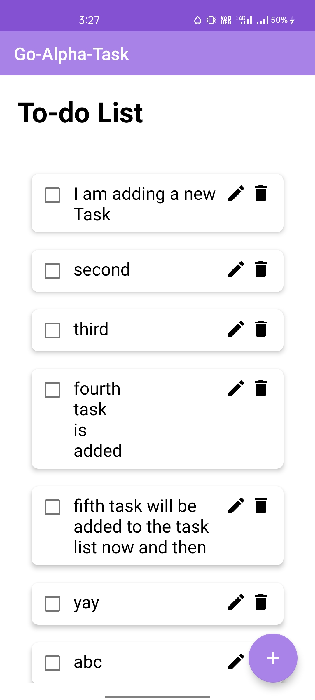
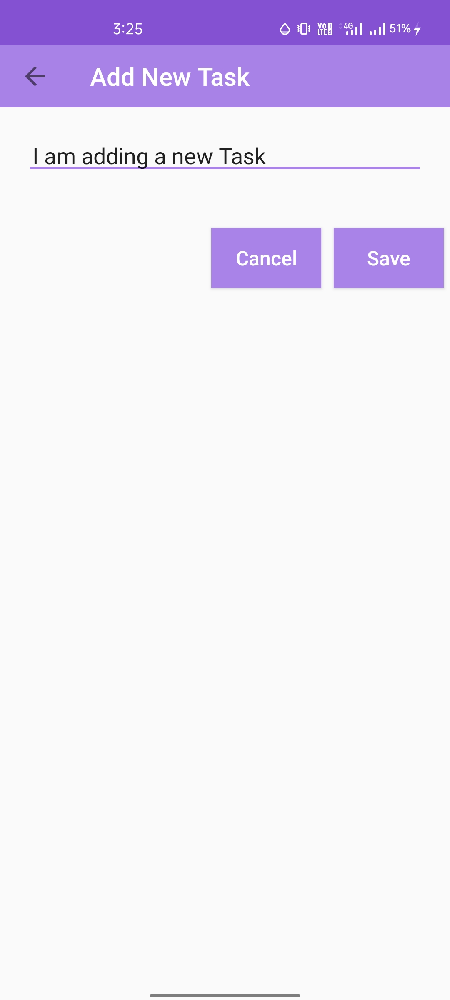
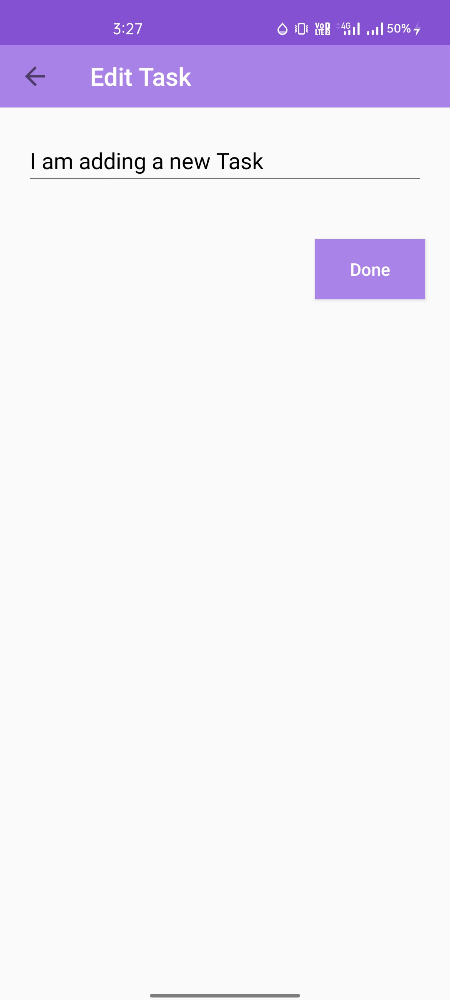
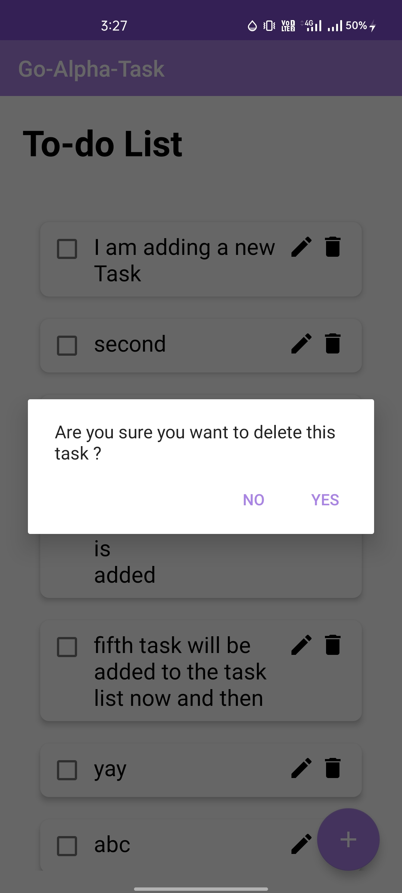
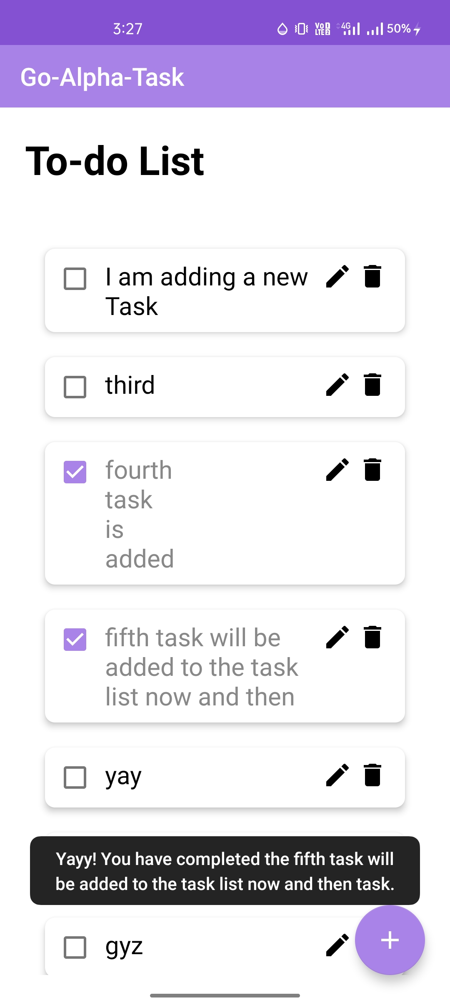

# To-Do List Application 

## Overview

This Android application allows users to manage their tasks efficiently by providing features to add, edit, and delete tasks. Tasks are stored persistently using ROOM database.

## Features

- Add new tasks
- Edit existing tasks
- Delete tasks
- Display list of tasks

## Implementation Details

- Developed using Java in Android Studio.
- Utilized ROOM database for persistent storage of tasks.
- Implemented RecyclerView for displaying the list of tasks. List is scrollable.
- Implemented CRUD (Create, Read, Update, Delete) operations for managing tasks.

## User Interface Design

Contributions and feedback are welcome.

